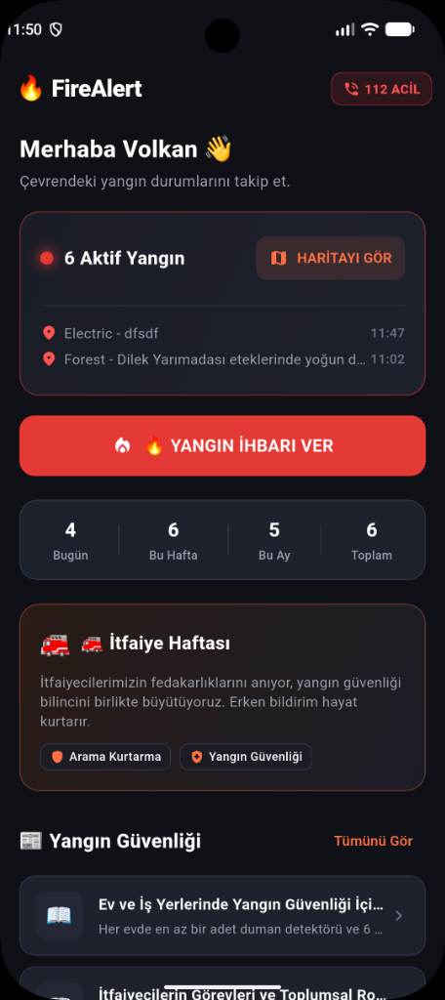
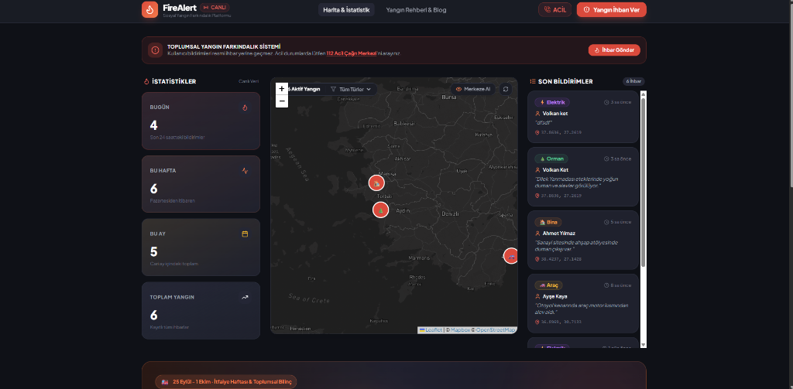
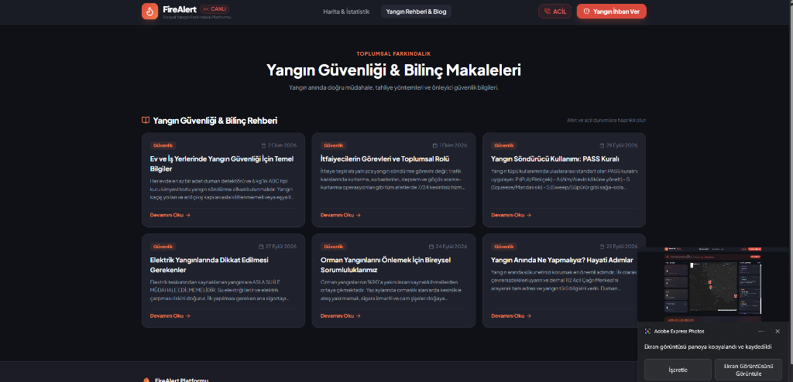

# 🔥 FireAlert – Sosyal Yangın Farkındalık ve Canlı Takip Platformu

<p align="center">
  
  
  
  
  
  
  
  
</p>

---

## 📌 Proje Hakkında

**FireAlert**, vatandaşların gördükleri yangınları anlık GPS konum bilgisi ve görsellerle bildirebildiği, bu bildirimlerin eş zamanlı olarak web haritasında ve mobil cihazlarda görüntülendiği, aynı zamanda yangın güvenliği bilincini yükseltmeyi hedefleyen **açık kaynaklı, gerçek zamanlı bir sosyal sorumluluk ve farkındalık platformudur**.

> [!CAUTION]
> **HAYATİ VE YASAL UYARI:**  
> FireAlert resmi bir devlet itfaiye ihbar sistemi değildir. Kullanıcılar tarafından oluşturulan bildirimler resmi olarak doğrulanmış acil durum çağrısı sayılmaz. Yangın ve acil durumlarda vakit kaybetmeden derhal **112 Acil Çağrı Merkezi**'ni arayınız.

---

## 📸 Ekran Görüntüleri

### 📱 Mobil Uygulama (Flutter)

<p align="center">
  
</p>
<p align="center">
  <em>Kullanıcı Dostu Dark Tema, Canlı Yangın Sayaçları, Acil 112 Çağrı Erişimi ve Yangın Güvenlik Rehberi</em>
</p>

---

### 💻 Web Platformu (React + Vite)

#### 🔴 Canlı Yangın Haritası & İhbar Akışı
<p align="center">
  
</p>
<p align="center">
  <em>Mapbox Dark HD Harita Katmanı, Anlık Bildirim Akışı ve SignalR Gerçek Zamanlı İstatistik Paneli</em>
</p>

#### 📖 Yangın Güvenliği & Bilinç Rehberi
<p align="center">
  
</p>
<p align="center">
  <em>İtfaiye Haftası Özel Bölümü, PASS Söndürme Metodu ve Yangın Önleme Rehberleri</em>
</p>

---

## ⚡ Öne Çıkan Özellikler & Mimari İlkeler

### 1. 🚫 Sıfır Sürtünme: Giriş ve Şifresiz Kullanıcı Deneyimi
- **Kullanıcı Kaydı & Şifre Yok:** Login, Register, JWT veya veritabanı kullanıcı tablosu bulunmaz.
- **Yerel Saklama (Local Onboarding):** Mobil uygulama ilk açılışta yalnızca kullanıcıdan **Ad Soyad** alır ve cihazın güvenli yerel hafızasında (`GetStorage`) saklar.
- **Doğrudan Web Erişimi:** Web paneline giren herkes canlı haritayı, son bildirimleri ve istatistikleri doğrudan anlık olarak izleyebilir.

### 2. ⚡ Gerçek Zamanlı SignalR Veri Akışı
- Mobil uygulamadan yeni bir yangın ihbarı gönderildiğinde:
  1. `.NET 10 API` isteği karşılar ve veritabanına işler.
  2. `SignalR FireHub` üzerinden tüm bağlı istemcilere `FireReportCreated` olayı fırlatılır.
  3. React Dashboard haritasına anında animasyonlu marker eklenir, istatistik sayaçları canlı güncellenir ve sesli/görsel bildirim (toast) gösterilir.

### 3. 🗺️ Yüksek Çözünürlüklü Harita Deneyimi
- **Mapbox Dark HD Desteği:** Modern gece/karanlık temalı harita katmanı.
- **Akıllı Fallback:** Çevrimdışı veya anahtar tanımlanmayan senaryolarda kesintisiz çalışan CartoDB Dark ve OpenStreetMap katman yedeklemesi.

---

## 🏗️ Sistem ve Veri Akış Mimarisi

```text
                                 ┌─────────────────────────────────┐
                                 │       Flutter Mobil App         │
                                 │ (GetX + Geolocator + GetStorage)│
                                 └───────────────┬─────────────────┘
                                                 │
                                                 │ HTTP POST /api/fire-reports
                                                 ▼
                                 ┌─────────────────────────────────┐
                                 │        .NET 10 Web API          │
                                 │ (Clean Architecture + EF Core)  │
                                 └───────┬─────────────────┬───────┘
                                         │                 │
                         Veri Kaydı      │                 │ SignalR Event
                                         ▼                 ▼
                              ┌──────────────────┐  ┌───────────────────────┐
                              │ PostgreSQL / DB  │  │    SignalR FireHub    │
                              │ (EF Core Model)  │  │ (FireReportCreated)   │
                              └──────────────────┘  └───────────┬───────────┘
                                                                │
                                                                │ WebSocket / SSE (Anlık Push)
                                                                ▼
                                                    ┌───────────────────────┐
                                                    │ React Web Dashboard   │
                                                    │ (Leaflet + Tailwind)  │
                                                    └───────────────────────┘
```

---

## 🛠️ Teknoloji Yığını

### 📱 Mobil Uygulama (Mobile)
- **Framework:** Flutter 3.x (Dart 3.x)
- **State Management:** GetX (Reactive State, Bindings, Routing)
- **HTTP / Ağ:** Dio
- **Yerel Depolama:** GetStorage (`StorageService`)
- **Harita & Konum:** `flutter_map`, `latlong2`, `geolocator`, `permission_handler`
- **Görsel Seçici:** `image_picker` (Kamera ve Galeri)
- **Acil Arama:** `url_launcher` (`tel:112`)

### ⚙️ Backend Web API
- **Framework:** .NET 10 (C# 13, ASP.NET Core Web API)
- **Mimari:** Clean Architecture (Domain, Application, Infrastructure, API)
- **Veritabanı / ORM:** Entity Framework Core, PostgreSQL (`Npgsql`) & SQLite desteği
- **Gerçek Zamanlı:** Microsoft SignalR Core (`/hubs/fire`)
- **API Dokümantasyonu:** Swagger / OpenAPI
- **Test:** xUnit, FluentAssertions, Moq

### 💻 Web Dashboard & Blog
- **Framework:** React 18, TypeScript, Vite
- **Stil & Tasarım:** Tailwind CSS (Dark Charcoal & Fire Accent Palette)
- **Canlı Soket:** `@microsoft/signalr` Client
- **Harita:** Leaflet & React-Leaflet (Mapbox HD Dark Layer & OSM Fallback)
- **İkonografi:** Lucide React

---

## 📂 Monorepo Klasör Yapısı

```text
FireAlert/
│
├── mobile/                        # Flutter Mobil Uygulaması
│   ├── lib/
│   │   ├── app/                   # Rotalar, Tema Yapılandırması, Global Bindings
│   │   ├── core/                  # Ağ İstemcisi, Depolama Servisi, Yardımcılar
│   │   ├── data/                  # Modeller, Sağlayıcılar, Repository Katmanı
│   │   └── modules/               # Onboarding, Home, Fire Report, Map, Blog, Emergency
│   └── test/                      # Mobil Birim ve Widget Testleri
│
├── backend/                       # .NET 10 Web API Katmanlı Mimarisi
│   ├── src/
│   │   ├── FireAlert.Domain/          # Entity'ler, Değer Nesneleri, Enum'lar
│   │   ├── FireAlert.Application/     # DTO'lar, Arayüzler ve Servisler
│   │   ├── FireAlert.Infrastructure/  # DbContext, Repository'ler, SignalR ve Seed Data
│   │   └── FireAlert.Api/             # Controller'lar, Hub'lar, Dependency Injection
│   └── tests/
│       └── FireAlert.UnitTests/       # Backend xUnit Testleri
│
├── web/                           # React + TypeScript + Vite Dashboard
│   ├── src/
│   │   ├── components/            # Harita, İstatistik Kartları, Toast, Modal
│   │   ├── pages/                 # Canlı Dashboard ve Blog Detay Sayfası
│   │   ├── services/              # Axios REST ve SignalR Servisleri
│   │   └── types/                 # TypeScript Veri Arayüzleri
│   └── index.html
│
├── docs/                          # Proje Ekran Görüntüleri ve Ek Dokümanlar
├── .gitignore                     # Hassas Veri ve Yapılandırma Dışlama Kuralları
└── README.md
```

---

## 📡 REST API & SignalR Uç Noktaları

### 🔴 Yangın İhbarları (`/api/fire-reports`)
| Metot | Uç Nokta | Açıklama |
| :--- | :--- | :--- |
| `GET` | `/api/fire-reports` | Sistemdeki tüm yangın bildirimlerini listeler |
| `GET` | `/api/fire-reports/active` | Aktif (İncelenen / Bildirilen) yangınları döner |
| `GET` | `/api/fire-reports/{id}` | Belirli bir yangın ihbarının detayını döner |
| `POST` | `/api/fire-reports` | Yeni bir yangın ihbarı kaydeder ve anında SignalR ile yayınlar |

**Örnek İhbar Gövdesi (JSON):**
```json
{
  "reporterName": "Volkan Ket",
  "fireType": "Forest",
  "description": "Dilek Yarımadası eteklerinde yoğun duman ve alevler görülüyor.",
  "latitude": 37.8636,
  "longitude": 27.2619,
  "imageUrl": null
}
```

### 📊 İstatistikler (`/api/statistics`)
| Metot | Uç Nokta | Açıklama |
| :--- | :--- | :--- |
| `GET` | `/api/statistics` | Bugün, Bu Hafta, Bu Ay ve Toplam ihbar istatistiklerini getirir |

### 📰 Yangın Güvenliği & Blog (`/api/blog`)
| Metot | Uç Nokta | Açıklama |
| :--- | :--- | :--- |
| `GET` | `/api/blog` | Yangın güvenliği ve bilinç makalelerini döner |
| `GET` | `/api/blog/{slug}` | Slug değerine göre makale detayını ve adımlarını döner |

### ⚡ SignalR Hub (`/hubs/fire`)
- `FireReportCreated`: Yeni bir yangın eklendiğinde tetiklenir, yeni ihbarı ve güncel istatistikleri iletir.
- `StatisticsUpdated`: İstatistikler değiştiğinde tüm istemcilere fırlatılır.

---

## 🚀 Hızlı Başlangıç ve Kurulum

### 1. Projeyi Klonlayın
```bash
git clone https://github.com/ketvolkan/Yangin_Farkindalik_App_Fullstack.git FireAlert
cd FireAlert
```

### 2. Backend API (.NET 10)
```bash
cd backend/src/FireAlert.Api
dotnet restore
dotnet run
```
- API Adresi: `http://localhost:5000`
- Swagger Arayüzü: `http://localhost:5000/swagger`

### 3. Web Dashboard (React + Vite)
```bash
cd web
npm install
```
> [!TIP]
> Opsiyonel olarak `web` dizini altında `.env` dosyası oluşturup kendi Mapbox erişim anahtarınızı tanımlayabilirsiniz:
> ```env
> VITE_MAPBOX_ACCESS_TOKEN=your_mapbox_token_here
> ```
> *(Tanımlanmadığı durumda uygulama otomatik olarak yüksek kaliteli açık kaynak CartoDB Dark harita katmanına geçiş yapar).*

```bash
npm run dev
```
- Web Adresi: `http://localhost:3000`

### 4. Mobil Uygulama (Flutter)
```bash
cd mobile
flutter pub get
flutter run
```
